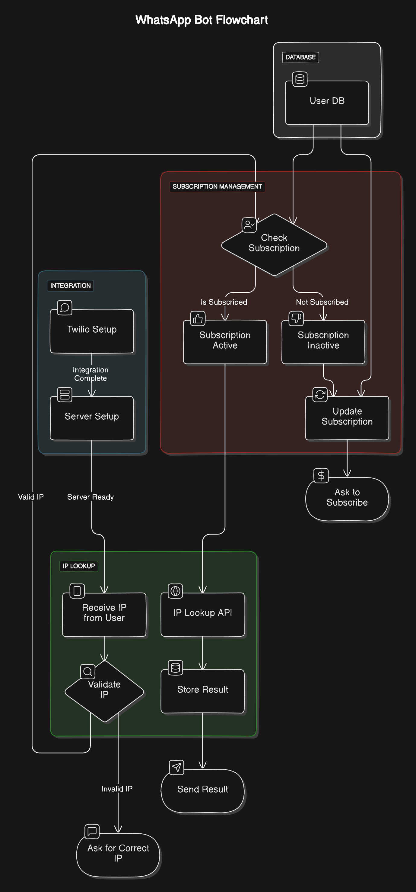

# IP Tracker WhatsApp Bot

A **WhatsApp bot** built using **Twilio Sandbox** that enables users to track and receive detailed IP location information efficiently. This bot is designed to manage user subscriptions and validate user-provided IP addresses, returning accurate data with the help of an IP lookup API.



## Features

- **Subscription Management**: Tracks user subscriptions and allows subscription updates.
- **IP Validation**: Validates user-provided IP addresses for accuracy.
- **IP Location Lookup**: Provides detailed IP location information via a third-party API.
- **WhatsApp Integration**: Seamlessly interacts with users through Twilio's WhatsApp Sandbox.
- **Database Integration**: Stores user information and IP lookup results securely.

---

## Tech Stack

- **Backend**: Node.js, Express
- **Database**: SQLite (with Sequelize ORM)
- **Payment Gateway**: Razorpay (for subscription management)
- **Third-party APIs**: Twilio (for WhatsApp integration), IP Lookup API
- **Templating Engine**: EJS
- **Environment Management**: dotenv
- **Utilities**: Axios for API calls

---

## Setup and Installation

1. **Clone the Repository**:
   ```bash
   git clone https://github.com/omthakare16/IP-Tracker-Whatsapp-Bot.git
   cd IP-Tracker-Whatsapp-Bot
   ```

2. **Install Dependencies**:
   ```bash
   npm install
   ```

3. **Set Up Environment Variables**:
   Create a `.env` file in the root directory and define the following variables:
   ```env
   PORT=3000
   TWILIO_ACCOUNT_SID=your_twilio_account_sid
   TWILIO_AUTH_TOKEN=your_twilio_auth_token
   TWILIO_PHONE_NUMBER=your_twilio_phone_number
   IP_LOOKUP_API_KEY=your_ip_lookup_api_key
   RAZORPAY_KEY_ID=your_razorpay_key_id
   RAZORPAY_KEY_SECRET=your_razorpay_key_secret
   BASE_URL=http://your_base_url
   ```

4. **Start the Server**:
   ```bash
   npm start
   ```

---

## Usage

1. **Connect to Twilio Sandbox**:
   - Set up your Twilio Sandbox for WhatsApp by following the instructions in the [Twilio Console](https://www.twilio.com/console/sms/whatsapp/sandbox).
   - Update the "When a message comes in" URL in the Twilio Sandbox configuration with:
     ```
     https://<your_base_url>/whatsapp
     ```

2. **Razorpay Integration**
  - To enable payments for subscriptions, the bot uses Razorpay. Follow these steps to configure Razorpay Webhooks:

  - Add a new webhook with the following details:
Webhook URL: <BASE_URL>/razorpay/webhook
  - Select the required events, such as payment.authorized or payment.failed. 

2. **Interact with the Bot**:
   - Send a message to your Twilio Sandbox number to start interacting with the bot.
   - Example commands:
     - Send an IP address to get its location details.
     - Subscribe to or update your subscription using provided commands.

---

## File Structure

```
├── index.js           # Main entry point for the application
├── routes/            # Defines API routes for Twilio and IP lookup
├── services/          # Contains business logic for IP validation and subscription management
├── views/             # EJS templates for rendering responses
├── database/          # Database connection and models using Sequelize
├── .env               # Environment configuration
├── package.json       # Dependencies and scripts
└── README.md          # Project documentation
```

---

## Dependencies

- **axios**: For making HTTP requests to external APIs.
- **dotenv**: For managing environment variables.
- **ejs**: For server-side rendering of templates.
- **express**: For creating the backend server.
- **razorpay**: For handling payment processing for subscriptions.
- **sequelize**: For database ORM.
- **sqlite3**: SQLite database driver.
- **twilio**: Twilio API for WhatsApp integration.
- **nodemon** (dev dependency): For live server reloading during development.

---

## Future Enhancements

- Add support for more advanced IP lookup services.
- Enable multi-language support for global users.
- Implement detailed analytics and usage tracking.

---

## License

This project is licensed under the [MIT License](LICENSE).

---

## Contributing

Contributions are welcome! Feel free to open an issue or submit a pull request with improvements or fixes.

---

## Contact

For any inquiries or support, contact the developer:

**Om Thakare**  
[GitHub](https://github.com/omthakare16) | [Email](mailto:omthakare1606@gmail.com)
